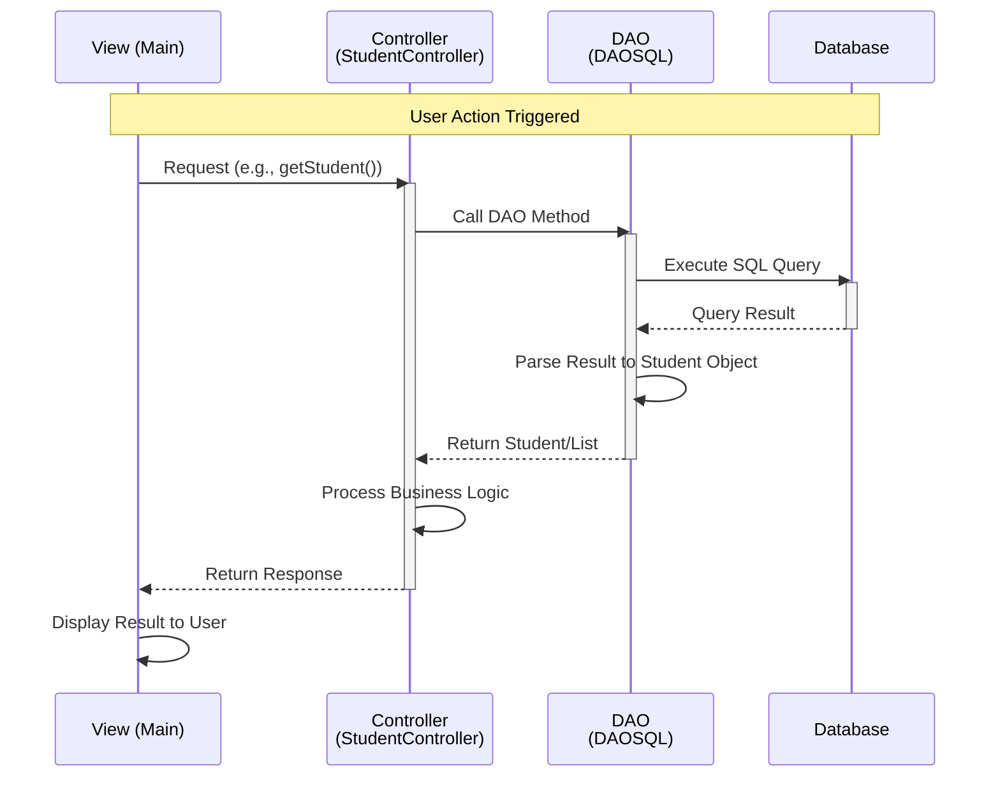

# MP0485_RA9_JDBC - Student Management System

## Project Overview

This project implements a Student Management System using Java with JDBC (Java Database Connectivity). It follows the MVC (Model-View-Controller) architectural pattern with a Data Access Object (DAO) layer for database operations.

## Architecture

The application is structured in the following layers:

- **View Layer**: User interface for interacting with the application
- **Controller Layer**: Business logic and request handling
- **DAO Layer**: Database access and persistence operations
- **Model Layer**: Data representation objects

## Sequence Diagram

Below is the sequence diagram illustrating the flow of data from the View layer through the Controller to the DAO layer:



## Project Structure

```
src/main/java/
├── api/
│   └── DataValidation.java          # Data validation utilities
├── controller/
│   ├── IStudentController.java       # Controller interface
│   └── StudentControllerImplementation.java  # Controller implementation
├── dao/
│   ├── IDAO.java                    # DAO interface
│   └── DAOSQL.java                  # SQL implementation
├── exception/
│   ├── DAO_Excep.java               # DAO exceptions
│   ├── Read_SQL_DAO_Excep.java      # Read operation exceptions
│   ├── Student_Excep.java           # Student-related exceptions
│   └── Write_SQL_DAO_Excep.java     # Write operation exceptions
├── model/
│   └── Student.java                 # Student data model
└── view/
    └── Main.java                    # Main entry point
```

## Data Flow Examples

### Reading Student Data
1. User requests to view a student (View)
2. Controller receives the request and validates input
3. Controller calls DAO's read method
4. DAO executes SQL SELECT query
5. DAO maps result to Student object
6. Controller processes and returns to View
7. View displays student information

### Writing Student Data
1. User submits new student information (View)
2. Controller validates the data using DataValidation
3. Controller calls DAO's write/create method
4. DAO executes SQL INSERT/UPDATE query
5. DAO returns success/failure status
6. Controller handles response
7. View confirms operation to user

## Technologies

- **Language**: Java
- **Build Tool**: Maven
- **Database**: SQL (via JDBC)
- **Design Pattern**: MVC + DAO

## Exception Handling

The application implements specific exception types for better error handling:

- `DAO_Excep`: Generic DAO exceptions
- `Read_SQL_DAO_Excep`: Read operation errors
- `Write_SQL_DAO_Excep`: Write operation errors
- `Student_Excep`: Student validation errors

## Getting Started

1. Configure your database connection in the DAO layer
2. Run the Maven build: `mvn clean compile`
3. Execute the main application from `Main.java`
